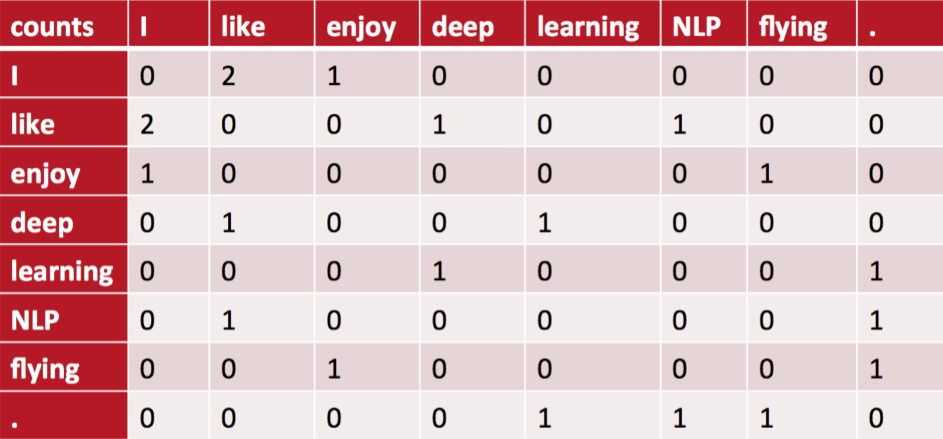

[TOC]

# GloVe

GloVe的全称叫 Global Vectors for Word Representation，它是一个基于全局词频统计（count-based & overall statistics）的词表征（word representation）工具，它可以把一个单词表达成一个由实数组成的向量，这些向量捕捉到了单词之间一些语义特性，比如相似性（similarity）、类比性（analogy）等。我们通过对向量的运算，比如欧几里得距离或者cosine相似度，可以计算出两个单词之间的语义相似性。

## 1 GloVe的实现步骤

### 1.1 构建共现矩阵

局域窗中的 word-word **共现矩阵** 可以挖掘语法和语义信息，例如：

- I like deep learning.
- I like NLP.
- I enjoy flying

有以上三句话，设置滑窗为2，可以得到一个词典：**{"I like","like deep","deep learning","like NLP","I enjoy","enjoy flying","I like"}**。

则，可以得到一个**共现矩阵** (对称矩阵)：

**GloVe的共现矩阵**

根据语料库（corpus）构建一个共现矩阵（Co-ocurrence Matrix）X，**矩阵中的每一个元素 Xij 代表单词 i 和上下文单词 j 在特定大小的上下文窗口（context window）内共同出现的次数。一般而言，这个次数的最小单位是1，但是GloVe不这么认为：它根据两个单词在上下文窗口的距离 d，提出了一个衰减函数（decreasing weighting）：decay=1/d 用于计算权重，也就是说距离越远的两个单词所占总计数（total count）的权重越小**。

### 1.2 词向量和共现矩阵的近似关系

构建词向量（Word Vector）和共现矩阵（Co-ocurrence Matrix）之间的近似关系，论文的作者提出以下的公式可以近似地表达两者之间的关系：

$v^T_iv_j+b_i+b_j=log(X_{i,j})$

其中， $v_i, v_j$ 是单词 $i$ 和单词 $j$ 的词向量； $b_i, b_j$ 是标量，分别是两个词向量的 bias term。

该公式怎么来的？

> 首先定义几个符号：
>
> $X_i=\sum_{j=1}^NX_{i,j}$   (其实就是共现矩阵单词 $i$ 那一行的和)
>
> $P_{i,k}=\frac{X_{i,k}}{X_i}$   (条件概率，表示单词 $k$ 出现在单词 $i$ 语境中的概率)
>
> $ratio_{i,j,k}=\frac{P_{i,k}}{P_{j,k}}$   (两个条件概率的比率)

而作者发现，$ratio_{i,j,k}$ 这个指标是有规律的，规律统计在下表：

| $ratio_{i,j,k}$的值   | 单词 $j,k$ 相关 | 单词 $j,k$ 不相关 |
| --------------------- | --------------- | ----------------- |
| **单词 $i,k$ 相关**   | 趋近1           | 很大              |
| **单词 $i,k$ 不相关** | 很小            | 趋近1             |

很简单的规律，但是有用。
思想：假设我们已经得到了词向量，如果用词向量 $v_i、v_j$、$v_k$ 通过某种函数计算 $ratio_{i,j,k}$ 能够同样得到这样的规律的话，就意味着词向量与共现矩阵具有很好的一致性，也就说明词向量中蕴含了共现矩阵中所蕴含的信息。
设用词向量 $v_i、v_j、v_k$ 计算 $ratio_{i,j,k}$ 的函数为 $g(v_i,v_j,v_k)$ (先不去管具体的函数形式），那么应该有：

$\underbrace{\frac{P_{i,k}}{P_{j,k}}}_{from 共现矩阵} = ratio_{i,j,k} = \underbrace{g(v_i,v_j,v_k)}_{from 词向量}$

则，很容易想到用二者的差方来作为代价函数：

$J= \sum_{i,j,k}^N( \frac{P_{i,k}}{P_{j,k}}−g(v_i,v_j,v_k))^2$

其中，$g(v_i,v_j,v_k)=exp((v_i−v_j)^Tv_k)$

关于该 $g(v_i,v_j,v_k)$ 函数，我其实并不是很明白怎么来的，但是有位作者解释的还不错：

>作者的脑洞是这样的：
>1. 要考虑单词 $i$ 和单词 $j$ 之间的关系，那 $g(v_i,v_j,v_k)$ 中大概要有这么一项吧：$v_i−v_j$；嗯，合理，在线性空间中考察两个向量的相似性，不失线性地考察，那么 $v_i−v_j$ 大概是个合理的选择；
>2. $ratio_{i,j,k}$ 是个标量，那么 $g(v_i,v_j,v_k)$ 最后应该是个标量啊，虽然其输入都是向量，那內积应该是合理的选择，于是应该有这么一项吧： $(v_i−v_j)^Tv_k$。
>3. 然后作者又往 $(v_i−v_j)^Tv_k$ 的外面套了一层指数运算 $exp()$，得到最终的 $g(v_i,v_j,v_k) = exp((v_i−v_j)^Tv_k)$ 。
>
>原文链接：https://blog.csdn.net/coderTC/article/details/73864097

则对于  $g(v_i,v_j,v_k)$ ，有

$\frac{P_{i,k}}{P_{j,k}} = g(v_i,v_j,v_k) = exp((v_i−v_j)^Tv_k) = exp(v^T_iv_k−v^T_jv_k) = \frac{exp(v^T_iv_k)}{exp(v^T_jv_k)}$

然后就发现找到简化方法了：只需要让上式分子对应相等，分母对应相等，即：

$P_{i,k}=exp(v^T_iv_k)并且P_{j,k}=exp(v^T_jv_k)$

然而分子分母形式相同，就可以把两者统一考虑了，即：

$P_{i,j}=exp(v^T_iv_j)$

即从原来的要求 $\frac{P_{i,k}}{P_{j,k}} = g(v_i,v_j,v_k)$ ，变为要求 $P_{i,j}=exp(v^T_iv_j)$ ，两边同时取对数得 $log(P_{i,j})=v^T_iv_j$

那么代价函数就可以简化为：$J= \sum_{i,j}^N(log(P_{i,j})−v^T_iv_j)^2$ 

因为 $P_{i,k}=\frac{X_{i,k}}{X_i}$ ，则 $log(P_{i,j}) = log(\frac{X_{i,j}}{X_i}) = log(X_{i,j}) - log(X_i)$ ， 又， $log(P_{i,j})=v^T_iv_j$

则有，$log(X_{i,j}) - log(X_i) = v^T_iv_j$ ，

此时，将 $log(X_i)$ 吸收到偏差项 $b_i$ 中，再添加一个偏置项 $b_j$ ，则有 $log(X_{i,j}) = v^T_iv_j + b_i+ b_j$

则，$log(P_{i,j})−v^T_iv_j = log(X_{i,j}) - log(X_i) = v^T_iv_j + b_i+ b_j - log(X_i)$

于是代价函数就变成了，$J=\sum_{i,j}^N(v^T_iv_j+b_i+b_j−log(X_{i,j}))^2$

 然后基于出现频率越高的词对儿权重应该越大的原则，在代价函数中添加权重项，于是代价函数进一步完善,

$J=\sum_{i,j}^N f(X_{i,j}) (v^T_iv_j+b_i+b_j−log(X_{i,j}))^2$

具体权重函数 $f(X_{i,j})$ 如下，

权重函数首先应该是非减的，其次当词频过高时，权重不应过分增大，作者通过实验确定权重函数为：
$$
\begin{equation}

f(X_{i,j})=

\begin{cases}

(x/x_{max})^{0.75}&\ {if \ \ x<x_{max}}\\

1&\ {if \ \ x>=x_{max}}

\end{cases}

\end{equation}
$$

## 2 GloVe与LSA、Word2Vec的比较

LSA（Latent Semantic Analysis）是一种比较早的count-based的词向量表征工具，它也是基于co-occurance matrix的，只不过采用了基于奇异值分解（SVD）的矩阵分解技术对大矩阵进行降维，而我们知道SVD的复杂度是很高的，所以它的计算代价比较大。还有一点是它对所有单词的统计权重都是一致的。而这些缺点在GloVe中被一一克服了。

而word2vec最大的缺点则是没有充分利用所有的语料，所以GloVe其实是把两者的优点结合了起来。从这篇论文给出的实验结果来看，GloVe的性能是远超LSA和word2vec的，但网上也有人说GloVe和word2vec实际表现其实差不多。

