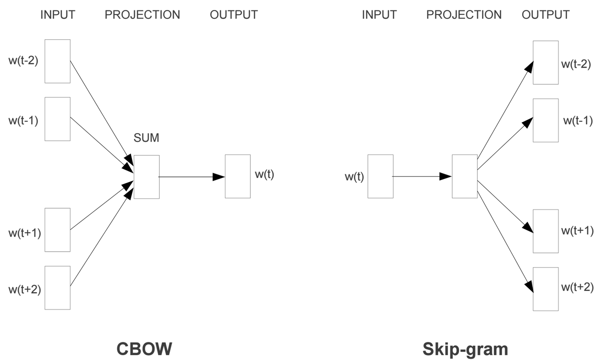

[TOC]

# Word2Vec

## 1 基本信息

论文： Fast unfolding of communities in large networks

arXiv链接： [Paper](http://arxiv.org/abs/0803.0476)

Loucain是一种基于**模块度**的图算法模型，该算法速度很快，而且对一些**点多边少**的图，进行聚类效果特别明显。

## 2 Skip-gram

Skip-gram 是**通过当前词来预测窗口中上下文词出现的概率模型**，把当前词当做 x，把窗口中其它词当做 y，通过一个隐层接一个 softmax 激活函数来预测其它词的概率。

## 3 CBOW

CBOW 获得中间词两边的的上下文，然后**用周围的词去预测中间的词**，把中间词当做 y，把窗口中的其它词当做 x 输入，x 输入是经过 one-hot 编码过的，然后通过一个隐层进行求和操作，最后通过激活函数 softmax，可以计算出每个单词的生成概率，接下来的任务就是训练神经网络的权重，使得语料库中所有单词的整体生成概率最大化，而求得的权重矩阵就是文本表示词向量的结果。

## 4 负例采样(Negative Sampling)

这种优化方式做的事情是，在正确单词以外的负样本中进行采样，最终目的是为了减少负样本的数量，达到减少计算量效果。

$J_{neg-sample}(u_o, v_c, U) = -log \sigma(u_o^Tv_c) - log\sum_{k \in \{K\ sampled\ indices\}}log\sigma(-u_k^Tv_c)$

## 5 层次Softmax

如果单单只是接一个softmax激活函数，计算量还是很大的，有多少词就会有多少维的权重矩阵，所以这里就提出\**层次Softmax(Hierarchical Softmax)**，使用Huffman Tree来编码输出层的词典，相当于平铺到各个叶子节点上，**瞬间把维度降低到了树的深度**，可以看如下图所示。这课Tree把出现频率高的词放到靠近根节点的叶子节点处，每一次只要做二分类计算，计算路径上所有非叶子节点词向量的贡献即可。

> **哈夫曼树(Huffman Tree)**：给定N个权值作为N个[叶子结点](https://baike.baidu.com/item/叶子结点/3620239)，构造一棵二叉树，若该树的带权路径长度达到最小，称这样的二叉树为最优二叉树，也称为哈夫曼树(Huffman Tree)。哈夫曼树是带权路径长度最短的树，权值较大的结点离根较近。

## 6 Word2Vec存在的问题

- 对每个local context window单独训练，没有利用包 含在global co-currence矩阵中的统计信息。
- 对多义词无法很好的表示和处理，因为使用了唯一的词向量
